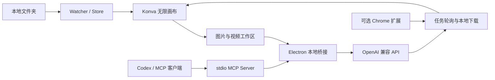

# Flow Canvas

Flow Canvas 是一款面向 Windows 的本地素材管理与 AI 创作桌面应用。它把文件夹中的图片、视频和音频组织到无限画布上，并将多 API 模型、图片生成、视频生成、任务恢复和 MCP 自动化集中在同一个工作区中。

当前稳定版本：`v1.0.0`

## 功能概览

### 本地无限画布

- 关联多个本地文件夹，并按文件夹组保存独立画板和视口。
- 支持缩放、平移、框选、拖放、边角等比缩放和素材排布。
- 直接索引原始文件路径，无需复制整个素材库。
- 支持图片、视频、音频及常见文档类型的识别和预览。
- 支持断联素材的手动重接、自动修补和模糊匹配。
- 支持把画板素材复制到映射的 Windows 资源管理器目录。
- 针对大型画板提供缩略图、视口裁剪和资源节省模式。

### 图片与视频创作

- `图片模式`：选择模型、生成/编辑模式、参考图、比例、尺寸和质量。
- `视频模式`：根据所选模型显示可用的时长、分辨率、画面比例、音频、联网搜索和水印参数。
- 支持配置多个 OpenAI 兼容 API，并分别调用不同供应商的图片、视频或对话模型。
- 支持从 `/v1/models` 拉取模型列表，也可以手动添加模型位。
- 大尺寸参考图提交前会询问是否压缩，压缩结果只用于上传，不覆盖原图。
- 生成任务可并行提交；画布会立即创建占位动画，完成后自动替换为本地素材。
- 图片清晰度切换与视频封面更新使用模糊过渡，减少黑屏闪烁。

### 任务记录与断线恢复

- 记录任务状态、提示词、模型、参数、参考素材和输出路径。
- 提示词可直接复制，失败任务可重试，断连任务可重新连接。
- 视频请求使用唯一 `X-Log-Id`。POST 连接意外关闭时，Flow Canvas 不会盲目重复提交，而是优先恢复轮询，降低重复任务和重复扣费风险。
- 应用重启后保留任务记录；已获得远端任务 ID 的视频可以继续查询和下载。
- 对不支持恢复协议的平台，可选用仓库内的 Chrome 同步扩展补充下载链路。

### MCP 与规划表

- Codex 等 MCP 客户端可以读取当前文件夹组、画板素材和规划表。
- 支持创建、读取和更新规划表及表格行。
- 支持通过 MCP 新增、更新、删除画板元素，并调用已授权的图片或视频模型。
- 本地桥接只监听 `127.0.0.1`，工具权限由 Flow Canvas 设置中的允许列表控制。

## 安装

### 使用安装包

从 [GitHub Releases](https://github.com/U-uu-U/flow-canvas/releases) 下载 `Flow Canvas Setup 1.0.0.exe`，按提示完成安装。

也可以下载便携版 `Flow Canvas 1.0.0.exe` 直接运行。当前安装包未进行商业代码签名，Windows 首次启动时可能显示 SmartScreen 提示。

### 从源码运行

环境要求：

- Windows 10 或 Windows 11
- Node.js 18 或更高版本
- npm 9 或更高版本

```powershell
git clone https://github.com/U-uu-U/flow-canvas.git
cd flow-canvas
npm ci
npm run electron:dev
```

依赖已经安装时，也可以运行：

```powershell
.\start.bat
```

仅预览前端界面：

```powershell
npm run dev
```

浏览器预览无法使用 Electron 文件系统、系统剪贴板、窗口置顶和资源管理器映射能力，完整功能应使用桌面应用。

## 快速开始

1. 启动 Flow Canvas，在左侧创建文件夹组并关联本地素材目录。
2. 使用右上角设置按钮添加 API 名称、Base URL 和 API Key。
3. 点击“拉取模型”，选择该 API 可用的模型并设置图片或视频用途。
4. 从右下角模式按钮进入图片模式或视频模式。
5. 选择模型和参数后开始生成；结果完成后会自动下载并写入当前画板。

RavenHash 入口可从设置页直接打开：

- [AI 中转站](https://ai.ravenhash.org/)
- [创作中转站](https://art.ravenhash.org/)

## API 兼容约定

Flow Canvas 面向 OpenAI 兼容服务设计。模型列表默认请求：

```text
GET /v1/models
```

视频服务通常需要支持：

```text
POST /v1/video/generations
GET  /v1/video/generations/{task_id}
```

也兼容使用 `/v1/tasks/{task_id}` 查询的视频服务。不同供应商的字段和能力并不完全一致，Flow Canvas 会根据模型配置决定可提交的时长、分辨率、比例及附加参数。

若要在 POST 响应提前关闭后无插件恢复任务，服务端需要：

1. 接收并持久化请求头 `X-Log-Id`。
2. 允许通过 `/v1/tasks/{log_id}` 或 `/v1/video/generations/{log_id}` 查询任务。
3. 上游任务 ID 尚未返回时响应 `202 pending`，获得后返回真实任务 ID。

## MCP 接入

先启动 Flow Canvas，再把 stdio 服务加入支持 MCP 的客户端。Windows 配置示例：

```json
{
  "mcpServers": {
    "flow-canvas": {
      "command": "node",
      "args": [
        "C:\\path\\to\\flow-canvas\\mcp\\flow-canvas-mcp.mjs"
      ],
      "env": {
        "FLOW_CANVAS_BRIDGE_URL": "http://127.0.0.1:18765"
      }
    }
  }
}
```

常用工具：

| 工具 | 用途 |
| --- | --- |
| `flow_canvas.context.get_active_group` | 读取当前文件夹组和画板上下文 |
| `flow_canvas.plan.*` | 创建、读取和更新规划表 |
| `flow_canvas.item.*` | 读取和维护画板素材 |
| `flow_canvas.image.generate` | 生成图片并写入当前画板 |
| `flow_canvas.video.generate` | 提交视频任务并将结果写入画板 |

默认本地桥接地址是 `http://127.0.0.1:18765`。可通过 `FLOW_CANVAS_MCP_PORT` 修改端口，或使用 `FLOW_CANVAS_BRIDGE_URL` 指向已经运行的桥接服务。

## 浏览器同步扩展

扩展主要用于兼容无法通过 API 恢复历史任务的平台，并不是正常生成流程的必需组件。

1. 在 Chrome 打开 `chrome://extensions`。
2. 启用“开发者模式”。
3. 选择“加载已解压的扩展程序”。
4. 加载 `browser-extension/flow-canvas-sync/`。
5. 按照[扩展说明](browser-extension/flow-canvas-sync/README.md)安装 Native Messaging 主机。

扩展仅注入以下站点：

- `https://ai.ravenhash.org/*`
- `https://art.ravenhash.org/*`

## 数据与隐私

画板主数据默认保存在：

```text
%APPDATA%\flow-canvas\data\board.json
```

同目录的 `backups/` 保存自动备份。画板数据包含文件路径、坐标、文件夹组和规划表，不包含原始素材文件本身。

API 配置和任务记录目前保存在 Electron 本地存储中。`v1.0.0` 尚未接入 Windows Credential Manager，因此不要提交 `%APPDATA%\flow-canvas`、浏览器用户数据、包含密钥的截图或本地配置文件。仓库的 `.gitignore` 已排除常见凭据、用户数据、生成媒体和安装包。

## 项目结构



| 目录 | 用途 |
| --- | --- |
| `src/` | Vite 前端、Konva 画布、素材侧栏及图片/视频工作区 |
| `electron-main/` | Electron 主进程、文件监听、缩略图、剪贴板、任务恢复与下载 |
| `shared/` | Electron 与 MCP 共用的规划表数据服务 |
| `mcp/` | stdio MCP 服务入口和工具定义 |
| `browser-extension/flow-canvas-sync/` | 可选 Chrome 任务同步扩展 |

核心技术：Electron 28、Vite 5、Konva 9、Sharp、Chokidar 和 GSAP。

## 开发与构建

```powershell
# 前端开发服务
npm run dev

# Electron 完整开发环境
npm run electron:dev

# 构建生产前端
npm run build

# 构建 Windows 安装版和便携版
npm run electron:build

# 单独启动 MCP stdio 服务
npm run mcp
```

Windows 构建产物写入 `release/`。提交代码前至少执行：

```powershell
node --check src/agent-sidebar.js
node --check src/canvas.js
node --check electron-main/mcp-bridge.js
npm run build
git diff --check
```

## v1.0.0 支持范围

- 桌面文件系统、剪贴板和资源管理器工作流目前只在 Windows 10/11 验证。
- macOS 和 Linux 尚未完成桌面能力适配。
- API 参数兼容程度取决于供应商对 OpenAI 风格端点和任务查询协议的实现。
- 安装包尚未进行代码签名，也没有内置自动更新。
- API Key 当前为本地应用存储，尚未使用系统凭据库加密。

## License

当前仓库尚未包含开源许可证。在许可证文件补充前，公开源码不代表自动授予使用、修改或再分发权利。
