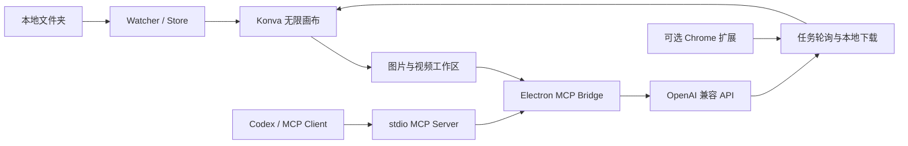

# Flow Canvas

Flow Canvas 是一个面向本地创作素材的 Windows 桌面无限画布。它将文件夹中的图片、视频和音频以路径索引的方式组织到画板中，并提供图片生成、视频生成、规划表、任务记录和 MCP 接入能力。

当前仓库为实验版本，主要用于验证本地素材工作流、多模型 API 编排，以及生成任务断线恢复。重要项目请保留原始素材，并定期备份 Flow Canvas 用户数据。

## 主要功能

### 本地素材画板

- 监听多个本地文件夹，并按文件夹组保存独立画板和视口。
- 使用 Konva 提供缩放、平移、框选、拖放和素材排布。
- 索引原文件路径，不会为了显示素材而复制整个资源库。
- 支持图片、视频、音频及常见文档类型的识别和预览。
- 支持手动重接、自动修补和模糊匹配断联素材。
- 支持将画板素材复制或映射到 Windows 资源管理器目录。

### 创作工作区

- `阅览模式`：保留完整画板和本地素材管理界面。
- `图片模式`：选择图片模型、参考图、尺寸和质量后直接生成并回填画板。
- `视频模式`：按模型能力显示画面比例、分辨率、时长、音频、联网搜索和水印参数。
- `设置模式`：管理多个 OpenAI 兼容 API、拉取模型列表并设置全局调用关系。
- 大尺寸视频参考图可在提交前确认压缩。
- 生成期间在画板中显示占位动画，完成后自动替换为本地文件。

### 任务记录与恢复

- 在图片和视频模式中记录提示词、模型、参数、素材和输出路径。
- 提示词可一键复制；失败任务可重试，断连任务可重新连接。
- 视频提交携带唯一 `X-Log-Id`。当 POST 响应连接意外关闭时，客户端不会重复提交，而是使用恢复 ID 继续 GET 轮询，避免重复任务和重复扣费。
- 应用重启后保留任务记录；已有远端任务 ID 的视频可以继续恢复和下载。

无插件恢复需要 API 服务端支持以下协议：

1. 接收并持久化请求头 `X-Log-Id`。
2. 允许通过 `/v1/tasks/{log_id}` 或 `/v1/video/generations/{log_id}` 查询任务。
3. 上游任务 ID 尚未返回时响应 `202 pending`，获得后返回真实任务 ID。

不支持该协议的服务仍可使用仓库中的浏览器扩展作为补充下载链路。

### MCP 与规划表

Flow Canvas 启动后会在本机开放受限 HTTP 桥接。配套 MCP 服务可以让 Codex 等客户端读取当前文件夹组、规划表和画板素材，并执行受允许的新增、更新、删除和生成操作。

默认地址：

- Vite 开发服务：`http://127.0.0.1:15321`
- Flow Canvas 本地桥接：`http://127.0.0.1:18765`

桥接只监听 `127.0.0.1`，可用工具由 Flow Canvas 设置中的允许列表控制。

## 技术架构



| 目录 | 作用 |
| --- | --- |
| `src/` | Vite 前端、Konva 画布、素材侧栏和图片/视频工作区 |
| `electron-main/` | Electron 主进程、文件监听、缩略图、剪贴板、生成请求和任务恢复 |
| `shared/` | Electron 与 MCP 共用的规划表数据服务 |
| `mcp/` | stdio MCP 服务入口与工具定义 |
| `browser-extension/flow-canvas-sync/` | 可选 Chrome 任务同步与 Native Messaging 扩展 |

核心技术：Electron 28、Vite 5、Konva 9、Sharp 和 Chokidar。

## 环境要求

- Windows 10 或 Windows 11。
- Node.js 18 或更高版本。
- npm 9 或更高版本。
- 使用外部生成能力时，需要一个 OpenAI 兼容 API Key。

当前版本重点适配 Windows。其他桌面平台尚未验证文件剪贴板、资源管理器映射和安装包行为。

## 本地运行

```powershell
git clone https://github.com/U-uu-U/flow-canvas.git
cd flow-canvas
npm ci
npm run electron:dev
```

也可以在依赖已安装后运行：

```powershell
.\start.bat
```

仅启动前端预览：

```powershell
npm run dev
```

浏览器预览无法使用 Electron 文件系统、系统剪贴板和窗口能力，完整体验应使用 `npm run electron:dev`。

## API 配置

1. 打开右上角设置。
2. 添加 API 名称、Base URL 和 API Key。
3. 点击拉取模型，从 `/v1/models` 返回结果中选择模型。
4. 为模型选择图片或视频用途，并配置相应能力参数。
5. 返回图片模式或视频模式开始生成。

Flow Canvas 会根据配置规范化常见 OpenAI 兼容端点。视频服务至少需要支持：

```text
POST /v1/video/generations
GET  /v1/video/generations/{task_id}
```

也兼容使用 `/v1/tasks/{task_id}` 轮询的视频服务。RavenHash 入口可从设置页直接打开：

- [AI 中转站](https://ai.ravenhash.org/)
- [创作中转站](https://art.ravenhash.org/)

## MCP 接入

先启动 Flow Canvas，再把以下服务加入支持 MCP stdio 的客户端。Windows 示例：

```json
{
  "mcpServers": {
    "flow-canvas": {
      "command": "node",
      "args": [
        "E:\\案例\\flow-canvas\\mcp\\flow-canvas-mcp.mjs"
      ],
      "env": {
        "FLOW_CANVAS_BRIDGE_URL": "http://127.0.0.1:18765"
      }
    }
  }
}
```

常用工具包括：

- `flow_canvas.context.get_active_group`：读取当前文件夹组和画板上下文。
- `flow_canvas.plan.*`：创建、读取和更新规划表及表格行。
- `flow_canvas.item.*`：读取和维护画板素材。
- `flow_canvas.image.generate`：生成图片并写入当前画板。
- `flow_canvas.video.generate`：提交视频任务、下载结果并写入当前画板。

可通过环境变量 `FLOW_CANVAS_MCP_PORT` 修改默认端口，或使用 `FLOW_CANVAS_BRIDGE_URL` 指向已经运行的本地桥接。

## 可选浏览器同步

浏览器扩展用于兼容尚未支持恢复协议的任务平台，也可以接管已登录 RavenHash 页面的历史任务下载。它不是支持恢复 ID 的新任务所必需的步骤。

1. 在 Chrome 打开 `chrome://extensions`。
2. 启用“开发者模式”。
3. 选择“加载已解压的扩展程序”。
4. 加载 `browser-extension/flow-canvas-sync/`。
5. 复制扩展 ID，运行 `browser-extension/flow-canvas-sync/install.bat <扩展ID>`。
6. 重新加载扩展，并保持兼容站点处于登录状态。

扩展只注入以下站点：

- `https://ai.ravenhash.org/*`
- `https://art.ravenhash.org/*`

页面登录令牌仅在页面上下文内用于调用同源任务接口，不会发送给扩展后台或 Flow Canvas。更多说明见 [扩展 README](browser-extension/flow-canvas-sync/README.md)。

## 数据与隐私

画板主数据默认保存在：

```text
%APPDATA%\flow-canvas\data\board.json
```

同目录的 `backups/` 保存自动备份。画板数据主要包含文件路径、坐标、文件夹组和规划表，不包含原始素材文件本身。

API 配置和任务记录目前保存在 Electron `localStorage`。API Key 尚未接入 Windows Credential Manager，请勿把 `%APPDATA%\flow-canvas`、浏览器用户数据或包含密钥的截图提交到仓库。

仓库的 `.gitignore` 已排除常见凭据、用户数据、数据库、生成媒体、安装包和测试输出，但提交前仍应检查：

```powershell
git status --short
```

## 构建

构建生产前端：

```powershell
npm run build
```

构建 Windows 安装版和便携版：

```powershell
npm run electron:build
```

产物写入 `release/`。当前仓库未配置正式应用图标和代码签名证书，Windows 可能显示 SmartScreen 提示。

| 命令 | 说明 |
| --- | --- |
| `npm run dev` | 启动 Vite 前端开发服务 |
| `npm run electron:dev` | 启动 Vite 与 Electron 完整开发环境 |
| `npm run build` | 构建生产前端 |
| `npm run electron:build` | 构建 Windows 安装版和便携版 |
| `npm run mcp` | 单独启动 stdio MCP 服务 |

## 常见问题

### 素材显示为断联

先确认原文件仍存在，再使用画板右键菜单中的自动修补或手动重接。自动修补会基于文件名、扩展名和相近路径进行容错匹配；重接后保留画板位置和显示尺寸。

### 视频已在服务器处理，本地却显示断开

不要立即重新生成。打开任务记录并点击“重新连接”。如果记录中存在任务 ID，Flow Canvas 只会恢复 GET 轮询，不会重新提交 POST。若服务端不支持 `X-Log-Id` 恢复协议，则需要通过兼容平台获取真实任务 ID，或启用可选浏览器扩展。

### 模型列表拉取失败

检查 Base URL 是否指向 OpenAI 兼容 API 根路径、API Key 是否有效，以及服务是否实现 `/v1/models`。错误信息会显示在设置页对应 API 项中。

### 图片参考素材过大

视频提交前可选择压缩参考图。压缩只生成用于上传的内存数据，不会覆盖本地原图。

### 开发端口被占用

结束旧的 Flow Canvas 开发进程后重新运行 `npm run electron:dev`。Vite 固定使用 `15321`，本地桥接默认使用 `18765`。

## 开发状态

该项目仍处于实验阶段，以下方面尚未完成稳定承诺：

- 跨版本数据迁移和异常退出恢复。
- 大型画板及高分辨率素材的内存优化。
- 不同视频供应商参数能力的完整校验。
- API Key 的系统凭据加密存储。
- macOS 和 Linux 的桌面能力适配。
- 安装包签名和自动更新。

提交变更前至少执行：

```powershell
node --check src/agent-sidebar.js
npm run build
git diff --check
```

## License

仓库目前未包含开源许可证文件。在许可证补充前，源码的使用、修改与再分发不自动获得开源授权。
